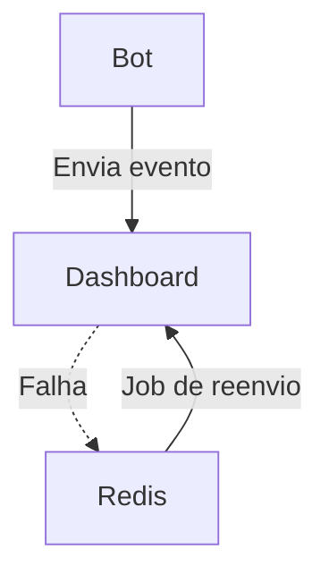

# Integração do Bot WhatsApp com Dashboard

Este documento detalha a implementação, uso, fluxos de erro, segurança, automação e boas práticas do serviço de integração entre o bot WhatsApp e a dashboard administrativa, localizado em `src/services/dashboardIntegration.js`.


## Visão Geral

O serviço permite que eventos, métricas e status do bot sejam enviados e consultados pela dashboard via API REST, com suporte a autenticação, retry automático, fallback para fila local (Redis), validação de dados, automação de reenvio, monitoramento e configuração flexível.


---

## Versionamento e Compatibilidade de API

- Sempre versionar endpoints REST (ex: `/api/v1/events`).
- Documentar mudanças breaking change e manter compatibilidade retroativa sempre que possível.
- Utilizar contratos de API (OpenAPI/Swagger) e validar payloads automaticamente.
- Recomenda-se testes de integração entre versões antes de deploy.

---

## Segurança Avançada

- Implemente rate limit (ex: 100 req/min por IP/token) na dashboard.
- Use CORS restritivo: apenas domínios autorizados.
- Proteja contra replay attack: utilize nonce/timestamp e rejeite requisições duplicadas.
- Gere logs de auditoria para todas as ações administrativas.
- Utilize autenticação multifator para acesso à dashboard.
- Faça rotação automática de tokens e revogue tokens comprometidos.
- Monitore tentativas de acesso suspeitas e bloqueie IPs maliciosos.

---

## Arquitetura para Alta Disponibilidade (HA)

- Utilize Redis em cluster ou replicação para evitar ponto único de falha.
- Implemente balanceamento de carga na dashboard (ex: NGINX, HAProxy).
- Use múltiplas instâncias do bot e dashboard para tolerância a falhas.
- Configure healthchecks automáticos e failover.
- Armazene logs e métricas em sistemas resilientes (ex: ELK, Loki, Prometheus).

---

## Observabilidade e Monitoramento Avançado

- Exporte métricas customizadas para Prometheus:
  - `dashboard_event_send_duration_seconds`
  - `dashboard_event_failure_total`
  - `dashboard_redis_queue_length`
- Crie dashboards no Grafana para monitorar eventos, falhas e filas.
- Configure alertas automáticos para filas acima do limite ou falhas consecutivas.
- Integre logs com ELK Stack ou Loki para busca e análise.

#### Exemplo de métrica Prometheus:
```js
const promClient = require('prom-client');
const eventDuration = new promClient.Histogram({
  name: 'dashboard_event_send_duration_seconds',
  help: 'Duração do envio de eventos para dashboard',
});
```

---

## Fallback e Reenvio Resiliente (Worker)

- Implemente workers dedicados para processar e reenviar eventos do Redis.
- Use backoff exponencial e circuit breaker para evitar sobrecarga.
- Registre tentativas, sucesso e falha de cada evento.

#### Pseudocódigo de worker resiliente:
```js
while (true) {
  const raw = await redis.lpop('dashboard:events');
  if (!raw) { await sleep(1000); continue; }
  try {
    await sendEventToDashboard(...);
    // sucesso, logar e seguir
  } catch (err) {
    await redis.rpush('dashboard:events', raw); // devolve ao final da fila
    await sleep(5000); // backoff
  }
}
```

---

## Troubleshooting (Erros Comuns e Soluções)

| Sintoma | Possível Causa | Solução |
|---------|---------------|---------|
| Eventos não chegam na dashboard | Dashboard offline, token inválido, payload inválido | Verifique status, logs e fila Redis |
| Fila Redis crescendo | Dashboard instável, worker parado | Reinicie worker, monitore dashboard |
| Erro 401/403 | Token expirado ou inválido | Gere novo token, revise variáveis de ambiente |
| Timeout | Latência de rede, dashboard sobrecarregada | Aumente timeout, otimize dashboard |

---

## Testes de Carga e Stress

- Utilize ferramentas como k6, Artillery ou JMeter para simular alto volume de eventos.
- Monitore latência, throughput e taxa de falha.
- Teste cenários de falha da dashboard e recuperação automática.

---

## Backup, Disaster Recovery e Retenção

- Programe backup automático do Redis (RDB/AOF) e armazene em local seguro.
- Teste restauração periodicamente.
- Defina política de retenção de eventos antigos.
- Documente plano de disaster recovery para bot, dashboard e Redis.

---

## Pipeline CI/CD Sugerido

- Lint, testes unitários e integração em cada push.
- Deploy automatizado com rollback em caso de falha.
- Testes de integração entre bot e dashboard em ambiente de staging.
- Geração automática de documentação (Swagger/OpenAPI).

---

## Padrões de Mensageria e Filas (Avançado)

- Para alto volume, considere uso de Redis Streams, RabbitMQ ou Kafka.
- Implemente dead-letter queue para eventos que falham repetidamente.
- Separe filas por tipo de evento para priorização.

---

Essas práticas tornam a integração referência em robustez, segurança, escalabilidade e observabilidade para ambientes críticos.

## Funcionalidades

- **Envio de eventos individuais** para a dashboard

# Integração Robusta do Bot WhatsApp com Dashboard

- **Monitoramento de fila local e automação de reenvio**


## Visão Geral

O serviço `dashboardIntegration` (em `src/services/dashboardIntegration.js`) permite que eventos, métricas e status do bot sejam enviados e consultados pela dashboard via API REST, com:

- Autenticação forte
- Retry automático com backoff exponencial
- Fallback para fila local (Redis)
- Validação rigorosa de dados
- Automação de reenvio
- Monitoramento e logs detalhados
- Configuração flexível
- Testes e checklist de produção


- Envio de eventos individuais e em lote
- Consulta de status e métricas
- Fallback para Redis se dashboard offline
- Retry automático e backoff exponencial
- Validação de dados e payloads
- Configuração de timeout, tentativas e headers
- Autenticação via Bearer Token
- Logs detalhados e métricas de observabilidade
- Monitoramento de fila local e automação de reenvio
- Testes unitários, mocks e integração
- Checklist de produção, rollback e FAQ


## Configuração


### Variáveis de Ambiente
DASHBOARD_URL=https://dashboard.exemplo.com
DASHBOARD_TOKEN=seu_token_aqui
DASHBOARD_TIMEOUT=5000
DASHBOARD_RETRIES=3
REDIS_URL=redis://localhost:6379
```


| Variável              | Descrição                                      | Exemplo                         |
|----------------------|------------------------------------------------|---------------------------------|
| DASHBOARD_URL        | URL base da API da dashboard                    | http://localhost:3001           |
| DASHBOARD_TOKEN      | Token JWT/API Key para autenticação             | abc123...                       |
| DASHBOARD_TIMEOUT    | Timeout (ms) para requisições                   | 5000                            |
| DASHBOARD_RETRIES    | Número de tentativas em caso de falha           | 3                               |
| REDIS_URL            | URL de conexão do Redis                         | redis://localhost:6379          |


---


Envia um evento individual para a dashboard.

- **event**: string (obrigatório)

- **payload**: objeto (obrigatório)

- **options**: `{ timeout, retries, headers, extra }` (opcional)


```js
await sendEventToDashboard('new_message', { userId: '123', text: 'Olá!' });
```

### 2. `sendBatchEvents(events, options)`

Envia múltiplos eventos em lote.


- **events**: array de `{ event, payload }` (obrigatório)

- **options**: `{ timeout, retries, headers }` (opcional)

#### Exemplo de uso:
```js

await sendBatchEvents([

  { event: 'order_update', payload: { orderId: 1, status: 'paid' } },

  { event: 'user_login', payload: { userId: '123' } }
]);
```


Consulta o status online/offline da dashboard.


#### Exemplo de uso:
```js
const status = await getDashboardStatus();

```

### 4. `getDashboardMetrics()`

Consulta métricas da dashboard (quantidade de usuários, pedidos, etc).

#### Exemplo de uso:
```js
const metrics = await getDashboardMetrics();
```

---


## Fallback para Redis e Automação de Reenvio

Se a dashboard estiver offline após todas as tentativas, o evento é salvo localmente em uma fila Redis (`dashboard:events`). Recomenda-se criar um job para reenviar esses eventos posteriormente.

#### Exemplo de leitura da fila:
```js
const events = await redis.lrange('dashboard:events', 0, -1);


  const { event, payload } = JSON.parse(raw);
  try {
    await sendEventToDashboard(event, payload);
    await redis.lrem('dashboard:events', 1, raw); // remove após sucesso
  } catch (err) {


  }





---


- O backoff é progressivo (500ms x tentativa).


## Autenticação


- Recomenda-se monitorar a fila Redis e criar alertas para eventos acumulados.

- Integre com ferramentas como Sentry, Datadog ou Prometheus para rastreamento avançado.


## Boas Práticas

- Sempre valide os dados antes de enviar.
- Monitore a fila local do Redis para garantir que eventos não fiquem presos.
- Configure o timeout e número de tentativas conforme a criticidade do evento.


- Proteja a API da dashboard com autenticação forte.


## Exemplo de Integração em Controller

```js

const { sendEventToDashboard } = require('../services/dashboardIntegration');

async function registrarPedido(req, res) {
  // ... lógica do pedido ...
  await sendEventToDashboard('order_created', { orderId: pedido.id, userId: pedido.userId });
  res.json({ ok: true });
}
```


---


- [ ] Variáveis de ambiente configuradas

- [ ] Token JWT/API Key seguro e rotativo
- [ ] Redis acessível e monitorado

- [ ] Dashboard protegida por HTTPS
- [ ] Jobs de reenvio automáticos configurados

- [ ] Logs e alertas ativos
- [ ] Testes automatizados rodando


## FAQ


**O que acontece se a dashboard estiver fora do ar?**


## Referências

- [Axios](https://axios-http.com/)
- [ioredis](https://github.com/luin/ioredis)
- [Node.js](https://nodejs.org/)
- [Mermaid Diagrams](https://mermaid-js.github.io/)

---

Este serviço garante robustez, rastreabilidade, flexibilidade e automação na comunicação entre o bot WhatsApp e a dashboard administrativa.
