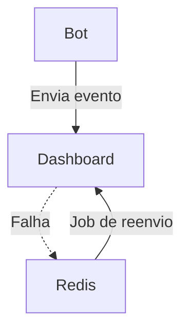

# Integração do Bot WhatsApp com Dashboard

Este documento detalha a implementação, uso, fluxos de erro, segurança, automação e boas práticas do serviço de integração entre o bot WhatsApp e a dashboard administrativa, localizado em `src/services/dashboardIntegration.js`.

---

## Visão Geral

O serviço permite que eventos, métricas e status do bot sejam enviados e consultados pela dashboard via API REST, com suporte a autenticação, retry automático, fallback para fila local (Redis), validação de dados, automação de reenvio, monitoramento e configuração flexível.

---

## Funcionalidades

- **Envio de eventos individuais** para a dashboard
- **Envio de eventos em lote** (batch)
- **Consulta de status** da dashboard
- **Consulta de métricas** da dashboard
- **Fallback para Redis** caso a dashboard esteja offline
- **Retry automático** com backoff exponencial
- **Validação de dados** dos eventos
- **Configuração de timeout e tentativas**
- **Autenticação via Bearer Token**
- **Logs detalhados de tentativas, tempo de resposta e erros**
- **Monitoramento de fila local e automação de reenvio**
- **Testes unitários e de integração**
- **Checklist de produção e FAQ**


## Configuração

### Variáveis de Ambiente

| Variável              | Descrição                                      | Exemplo                         |
|----------------------|------------------------------------------------|---------------------------------|
| DASHBOARD_URL        | URL base da API da dashboard                    | http://localhost:3001           |
| DASHBOARD_TOKEN      | Token JWT/API Key para autenticação             | abc123...                       |
| DASHBOARD_TIMEOUT    | Timeout (ms) para requisições                   | 5000                            |
| DASHBOARD_RETRIES    | Número de tentativas em caso de falha           | 3                               |
| REDIS_URL            | URL de conexão do Redis                         | redis://localhost:6379          |

---


## Métodos Disponíveis

### 1. `sendEventToDashboard(event, payload, options)`

Envia um evento individual para a dashboard.

- **event**: string (obrigatório)
- **payload**: objeto (obrigatório)
- **options**: `{ timeout, retries, headers, extra }` (opcional)

#### Exemplo de uso:
```js
await sendEventToDashboard('new_message', { userId: '123', text: 'Olá!' });
```

### 2. `sendBatchEvents(events, options)`

Envia múltiplos eventos em lote.

- **events**: array de `{ event, payload }` (obrigatório)
- **options**: `{ timeout, retries, headers }` (opcional)

#### Exemplo de uso:
```js
await sendBatchEvents([
  { event: 'order_update', payload: { orderId: 1, status: 'paid' } },
  { event: 'user_login', payload: { userId: '123' } }
]);
```

### 3. `getDashboardStatus()`

Consulta o status online/offline da dashboard.

#### Exemplo de uso:
```js
const status = await getDashboardStatus();
```

### 4. `getDashboardMetrics()`

Consulta métricas da dashboard (quantidade de usuários, pedidos, etc).

#### Exemplo de uso:
```js
const metrics = await getDashboardMetrics();
```

---


## Fallback para Redis e Automação de Reenvio

Se a dashboard estiver offline após todas as tentativas, o evento é salvo localmente em uma fila Redis (`dashboard:events`). Recomenda-se criar um job para reenviar esses eventos posteriormente.

#### Exemplo de leitura da fila:
```js
const events = await redis.lrange('dashboard:events', 0, -1);
```

#### Exemplo de job para reenvio automático:
```js
const { sendEventToDashboard } = require('./src/services/dashboardIntegration');
const events = await redis.lrange('dashboard:events', 0, -1);
for (const raw of events) {
  const { event, payload } = JSON.parse(raw);
  try {
    await sendEventToDashboard(event, payload);
    await redis.lrem('dashboard:events', 1, raw); // remove após sucesso
  } catch (err) {
    // mantém na fila para próxima tentativa
  }
}
```

#### Diagrama de fluxo:



---


## Validação de Dados

- O campo `event` deve ser uma string não vazia.
- O campo `payload` deve ser um objeto.
- O batch deve ser um array não vazio.
- Campos extras podem ser enviados via `options.extra`.
- Rejeita dados inválidos antes de tentar enviar.


## Retry Automático

- O número de tentativas e o timeout podem ser configurados via options ou variáveis de ambiente.
- O backoff é progressivo (500ms x tentativa).
- Todas as tentativas são logadas.
- Após todas as tentativas, o evento é salvo no Redis.


## Autenticação

- O token JWT/API Key deve ser definido em `DASHBOARD_TOKEN`.
- O header `Authorization: Bearer <token>` é enviado automaticamente.
- Recomenda-se rotacionar o token periodicamente.
- Proteja endpoints da dashboard contra brute-force e abuse.


## Logs e Monitoramento

- Todas as tentativas, falhas e tempos de resposta são logados via `logger`.
- Eventos salvos localmente são logados como warning.
- Recomenda-se monitorar a fila Redis e criar alertas para eventos acumulados.
- Integre com ferramentas como Sentry, Datadog ou Prometheus para rastreamento avançado.


## Boas Práticas

- Sempre valide os dados antes de enviar.
- Monitore a fila local do Redis para garantir que eventos não fiquem presos.
- Configure o timeout e número de tentativas conforme a criticidade do evento.
- Implemente um job para reenviar eventos do Redis em caso de falha prolongada da dashboard.
- Proteja a API da dashboard com autenticação forte.
- Use HTTPS para comunicação entre bot e dashboard.
- Limite o tamanho dos payloads enviados.
- Implemente rate limit na dashboard para evitar abuso.
- Documente todos os endpoints da dashboard.


## Exemplo de Integração em Controller

```js
const { sendEventToDashboard } = require('../services/dashboardIntegration');

async function registrarPedido(req, res) {
  // ... lógica do pedido ...
  await sendEventToDashboard('order_created', { orderId: pedido.id, userId: pedido.userId });
  res.json({ ok: true });
}
```

---


## Testes

- Crie testes unitários simulando falha de rede, timeout e validação de dados.
- Teste o fallback para Redis e a reenvio dos eventos.
- Teste integração com autenticação inválida.
- Teste limites de payload e rate limit.


## Checklist de Produção

- [ ] Variáveis de ambiente configuradas
- [ ] Token JWT/API Key seguro e rotativo
- [ ] Redis acessível e monitorado
- [ ] Dashboard protegida por HTTPS
- [ ] Jobs de reenvio automáticos configurados
- [ ] Logs e alertas ativos
- [ ] Testes automatizados rodando

## FAQ

**O que acontece se a dashboard estiver fora do ar?**
> Os eventos são salvos no Redis e podem ser reenviados automaticamente.

**Como garantir que nenhum evento se perca?**
> Monitore a fila Redis e implemente jobs de reenvio periódicos.

**Como aumentar a segurança?**
> Use HTTPS, tokens rotativos, rate limit e monitore acessos.

**Como escalar para alto volume?**
> Use Redis cluster, balanceamento de carga na dashboard e monitore filas.

## Referências

- [Axios](https://axios-http.com/)
- [ioredis](https://github.com/luin/ioredis)
- [Node.js](https://nodejs.org/)
- [Mermaid Diagrams](https://mermaid-js.github.io/)

---

Este serviço garante robustez, rastreabilidade, flexibilidade e automação na comunicação entre o bot WhatsApp e a dashboard administrativa.
