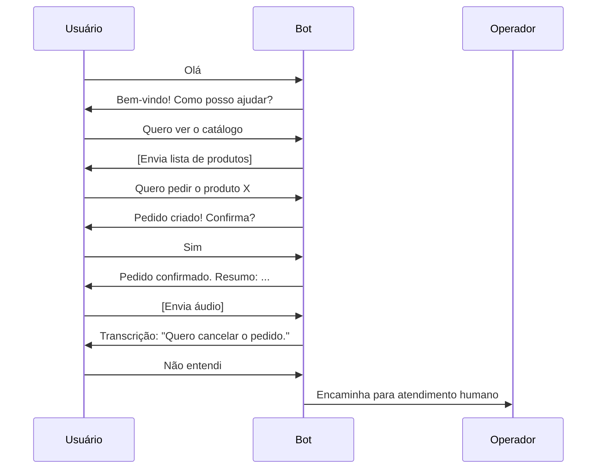

<div align="center">
  
  <h1>Fluxos Conversacionais</h1>
</div>

---

## Estrutura de Estados
Cada usuário possui um arquivo JSON em `userStates/` que armazena o contexto do atendimento, etapa do fluxo, dados do pedido e últimas interações.

### Exemplo de Estado
```json
{
  "step": "purchase_ask_name_robust",
  "data": {
    "name": "Lucas",
    "lastInteraction": "2025-07-25T18:27:09.034Z",
    "lastBotResponse": "👤 Para finalizar, envie seu *nome completo*:"
  }
}
```

---

## Principais Fluxos
| Fluxo                | Descrição |
|----------------------|-----------|
| Boas-vindas          | Mensagem inicial ao usuário |
| Consulta ao Catálogo | Usuário solicita produtos |
| Pedido               | Usuário faz pedido, confirma e recebe resumo |
| Transcrição de Áudio | Usuário envia áudio, bot responde com texto |
| Atendimento Humano   | Escalonamento para operador |
| Administração        | Rotas para admins gerenciarem usuários, produtos, pedidos |

---

## Exemplo Visual de Fluxo


---

## Boas Práticas de Fluxo
- Mensagens claras e objetivas
- Validação de entrada do usuário
- Escalonamento automático para operador em caso de erro ou dúvida
- Registro de todas interações para auditoria

---

## Logs e Auditoria
- Todas as interações são registradas em `logs/event.log`
- Auditoria de ações administrativas

---

## Personalização por Estado de Usuário
- O bot utiliza arquivos em `userStates/` para manter o contexto e personalizar o atendimento

---

## Referências
- [USER_STATES.md](./USER_STATES.md)
- [LOGS.md](./LOGS.md)
- Compra robusta
- Reclamação de produto
- Envio de currículo
- Atendimento automático

## Exemplo de Interação
1. Bot: "Olá! Qual produto deseja?"
2. Usuário: "Mesa luna"
3. Bot: "Quantas unidades?"
4. Usuário: "2"
5. Bot: "Qual seu nome completo?"

## Transições de Estado
- Cada resposta do usuário atualiza o estado
- Fluxos customizáveis via código
